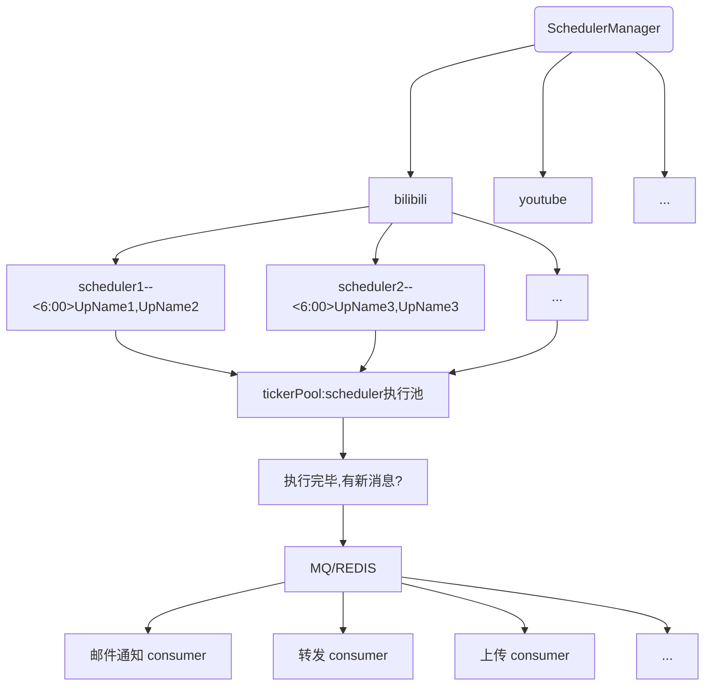

# simple-notifications
一个简单的订阅通知转发服务，预期功能包括
- 订阅UP的新投稿视频通知
- 支持多种通知方式
- 支持多个平台，多个UP主.
- 发现新视频投稿自动发布到其他平台,
- 发现新视频投稿后支持组合操作(发布到其他平台，下载，通知他人)
- 除了自媒体，支持体育赛事结果，新闻等其他新消息通知

#### 开发进度

- 基础功能
   - [x] ticker/schedule运行逻辑
   - [x] 运行计划持久化
- web服务
    - [x] http相关接口

- 任务结果储存
    - [x] mongodb
    - [x] file
    - [ ]  redis
    - [ ]  mysql

- 结果操作
    - [x] 邮件通知

- 已支持任务类型
    - [x] bilibili up主投稿内容通知

#### 运行部分大致逻辑

