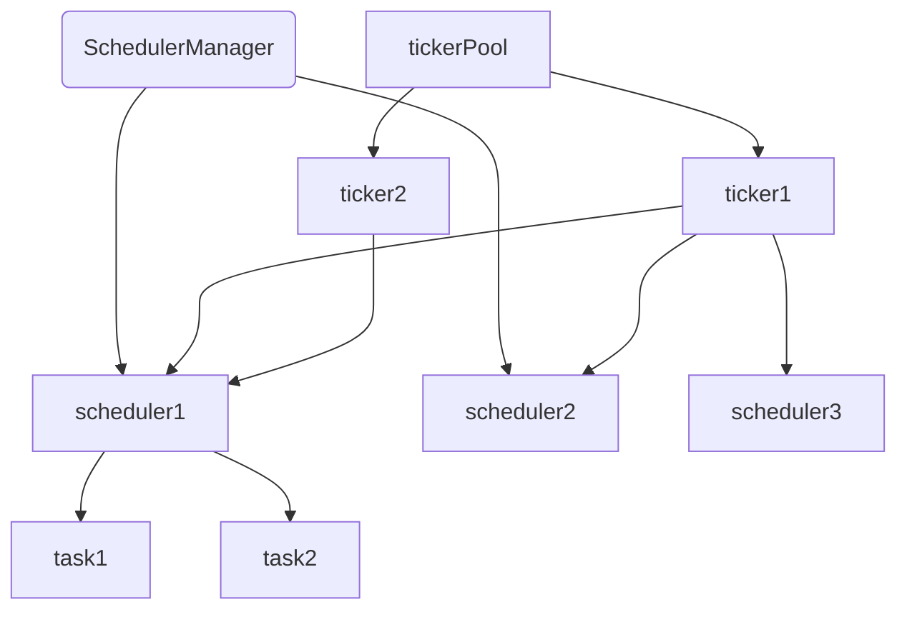

#### manager
所有的scheduler会通过manager来管理.	对scheduler的操作都必须经过manager.每个manager会对应一个tickerPool,用于管理所有的ticker

#### scheduler
运行计划,每个scheduler可以包含多个任务

#### task
每个scheduler会绑定多个task

#### ticker
实际运行scheduler的对象,每个ticker对应一个cron，可以同时运行多个scheduler.tickerPool是对所有ticker的管理，采用的类似线程池的实现方式是策略

