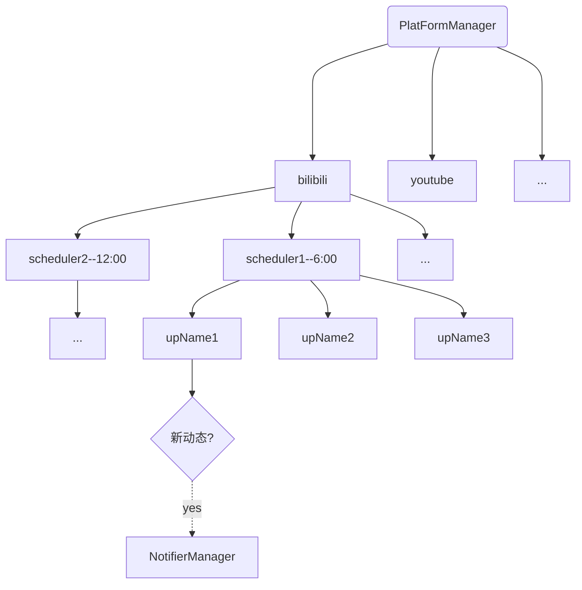

#### 每个平台会对应一个或多个scheduler,每个scheduler对应一个定时运行的时间点

##### 具体逻辑

```mermaid
graph TB

    A(PlatFormManager) ----> B[bilibili]
    A(PlatFormManager) ----> C[youtube]
    A(PlatFormManager) ----> F[...]
    B[bilibili] --> D[scheduler1--6:00]
    B[bilibili] --> E[scheduler2--12:00]-->H[...]
    B[bilibili] --> G[...]
    D[scheduler1--6:00]-->upName1 
    D[scheduler1--6:00]-->upName2 
    D[scheduler1--6:00]-->upName3
    upName1-->J{新动态?}
    J{新动态?} -.yes.-> K[NotifierManager]
```

